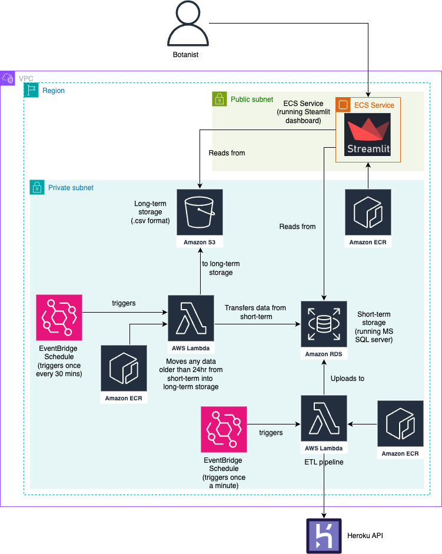
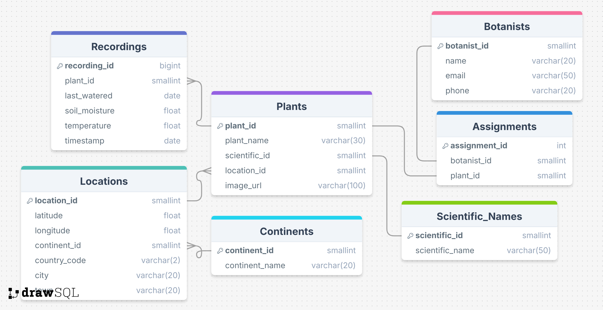

# Plant Health Monitoring at LNMH

# Project Overview

The Liverpool National Museum of History (LMNH) currently employs botanists to take recordings about the health of plants in their care via a Raspberry Pi, however, they did not have a system to easily analyse this data, in order to quickly call the gardeners if something went awry.

The solution to this issue we have proposed is an ETL pipeline, connected to visualisations hosted on a dashboard for easy access.
This allows for:

- Data to automatically be extracted, transformed and loaded into a database in the cloud.
- DAta older than 24 hours to be moved into a longer-term storage option for lower costs.
- Real time, filterable visualizations, accessible by staff at any time.

## Diagrams

The following diagram is the architecture plan for this project:

The database follows the below Entity-Relationship Diagram

The dashboard follows this wireframe:

## Prequisites

Python must be installed, with pip3 for the purpose of downloading dependencies.

All requirements are listed in a `requirements.txt` folder within all the following folders:
- `pipeline` - Containing all code relating to the extraction, transformation and loading of plant data.
- `database` -  Containing all code relating to the creation, moving and deletion of data from the database.
- `streamlit` - Containing all code relating to the creation and hosting of visualizations.

### Environment Variables

To connect to the Microsoft SQL Server, you'll need to set up the following environment variables in your `.env` file:

- `DB_HOST` – The hostname or IP address of your SQL Server.
- `DB_PORT` – The port number for your SQL Server (default is typically `1433`).
- `DB_USER` – The username used to authenticate to your SQL Server.
- `DB_PASSWORD` – The password associated with the `DB_USER`.
- `DB_NAME` – The name of the database you want to connect to.
- `SCHEMA_NAME` – The name of the schema you want to work with in the database.

